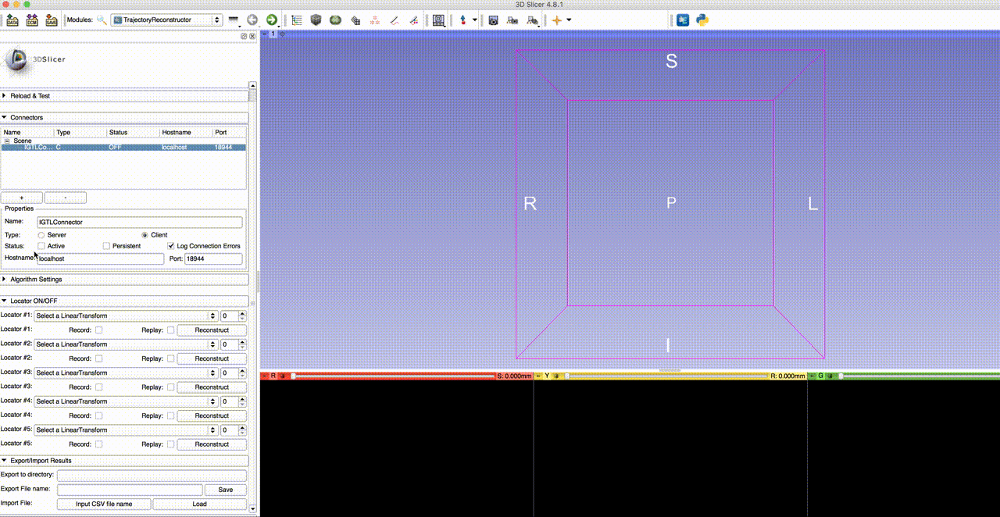
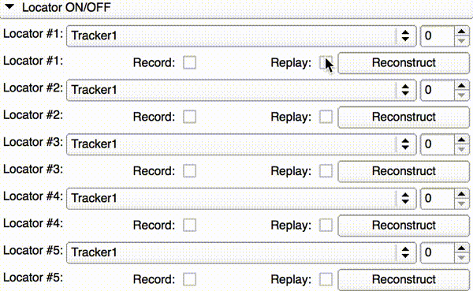
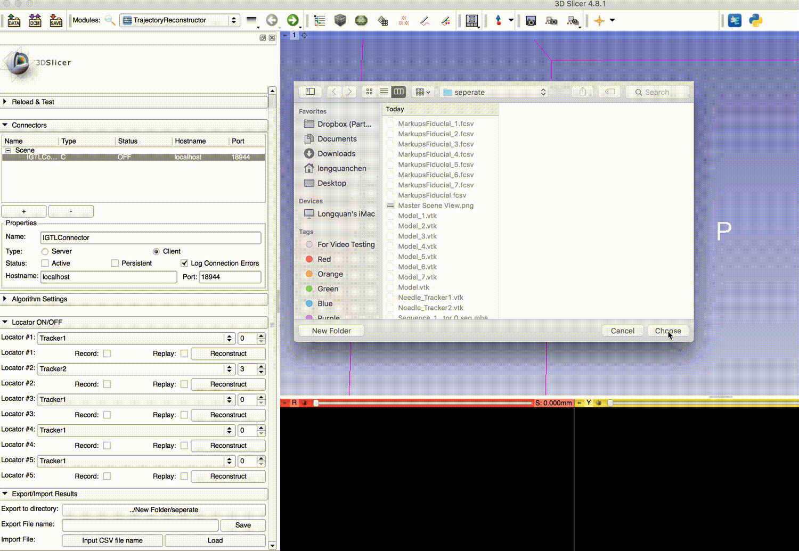

TrajectoryReconstructor
=======================

Overview
--------
TrajectoryReconstructor is a [3D Slicer](http://slicer.org) Module for MR tracking and trajectory reconstruction.

Installation
------------
TrajectoryReconstructor is currently provided only as source files. To install, obtian the code from [GitHub](https://github.com/i3-lab/TrajectoryReconstructor) or download [a zipped archive](https://github.com/i3-lab/TrajectoryReconstructor/archive/master.zip). If you use git command, you can download the code by:

~~~~
git clone https://github.com/i3-lab/TrajectoryReconstructor
~~~~

To add the module in 3D Slicer, open "Edit" -> "Application Setting" and select "Modules" in the menu on the left side of the "Setting" dialog window. Click the "Add" button in the "Additional module path" and choose the folder that contains the python script (e.g. "<Slicer module folder>/TrajectoryReconstructor/TrajectoryReconstructor"). After adding the path, you must click "OK" at the bottom right of the dialog box, and restart 3D Slicer. Note that there is a child "TrajectoryReconstructor" folder under the parent "TrajectoryReconstructor" folder, and you must specify the chlid folder. 

Once 3D Slicer is restarted, you could find the module from the module list under "IGT" section.

Usage
-----
1. Install the dependent [SlicerOpenIGTLink](https://github.com/openigtlink/SlicerOpenIGTLink), [Sequence](https://github.com/SlicerRt/Sequences) and [CurveMaker](https://github.com/tokjun/CurveMaker) extensions.
   If you are using Slicer Version earlier than 4.9.0, SlicerOpenIGTLink extension is not required.

2. After install the extensions, the user need to switch to the module `TrajectoryReconstructor`.

3. Setup the communication with the tracking data client using OpenIGTLinkIF panel, please refer to [SlicerOpenIGTLink](https://github.com/openigtlink/SlicerOpenIGTLink) for more information.

4. In the algorithm setting section. Kalman filter is used in the noise deduction, the user needs to set the parameters according to the measurement error and noise level. Two resampling parameters - MovementThreshold and ResampleWindowSize - can also be set here, if the mean position of points in the resampling window has a   movement larger than the threshold value, the point in this section with the largest movement Will be added to the downsampled points.  Also real-time trajectory reconstruc is possible by toggling the 'Real-time Reconstruct' checkbox.

5. Selector the locator to be tracked in the 'Locator' drop down selector.

6. Toggle the 'Record' checkbox, the transformation matrix of locator will be recorded and a tool representing the locator will be shown in the 3D view. Once the recording is finished, untoggle the 'Record' checkbox. 

7. Toggle the 'Replay' checkbox will replay the recorded tracking data. Make sure disconnect the communication with the tracking data client before toggling the replay checkbox, as the replay feature uses the same transformation node as the tracking data from client.

8. Export/Import using Slicer mrmlScene. Just save all the nodes and the mrmlScene in the same folder. Use the saved mrmlScene for importing.

9. Export to csv file. Choose the directory you would like to export the csv file.  Type the file name and click save.

10. Import csv file. Choose the csv file you would like to import.  Click Load button, a popup window will ask if you really want to proceed as the current mrmlScene will be cleared.
    After the file is loaded, you could click reconstruct button to reconstruct the trajectory and replay the sequence.

Disclaimer
----------

TrajectoryReconstructor is a research software. **TrajectoryReconstructor is NOT an FDA-approved medical device**. It is not intended for clinical use. The user assumes full responsibility to comply with the appropriate regulations.  

Support
-------

Please feel free to contact us for questions, feedback, suggestions, bugs, or you can create issues in the issue tracker: https://github.com/leochan2009/TrajectoryReconstructor/issues

* [Longquan Chen](https://github.com/leochan2009) lchen@bwh.harvard.edu

* [Junichi Tokuda](https://github.com/tokjun) tokuda@bwh.harvard.edu

Acknowledgments
---------------

Development of TrajectoryRecontruct is supported in part by the following NIH grants: 
* R01 EB020667 OpenIGTLink: a network communication interface for closed-loop image-guided interventions
* P41 EB015898 National Center for Image Guided Therapy (NCIGT), http://ncigt.org

